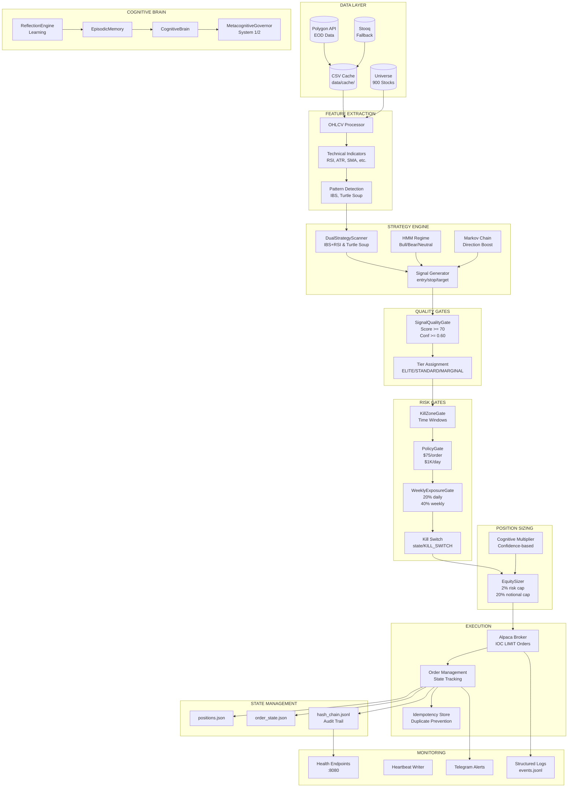

# KOBE TRADING ROBOT - FULL SYSTEM MAP

> **Version:** 1.0.0
> **Date:** 2026-01-06
> **Status:** Production Ready (Paper Trading)

---

## EXECUTIVE SUMMARY

Kobe is a production-grade algorithmic trading system with **1,400+ components** across **47+ integration points**. This document provides the complete system map showing how all components are wired together.

### Key Metrics
- **Account Equity:** $105,247.51
- **Open Positions:** 3 (CFG, PLTR, TSLA)
- **Tests Passing:** 476 (147 integration + 329 unit)
- **Safety Gates:** 7+ independent checkpoints
- **API Connections:** Alpaca (trading) + Polygon (data)

---

## SYSTEM ARCHITECTURE DIAGRAM



---

## PIPELINE EXECUTION ORDER

### 1. Data Acquisition
```
Polygon API → CSV Cache → DataFrame
              ↓
         (Fallback: Stooq → YFinance)
```

### 2. Signal Generation
```
OHLCV Data → Technical Indicators → DualStrategyScanner
                                           ↓
                                    Raw Signals
                                           ↓
                              HMM Regime + Markov Boost
                                           ↓
                                   Enriched Signals
```

### 3. Quality Filtering
```
Enriched Signals → SignalQualityGate
                          ↓
                   Score >= 70? ─No→ REJECTED
                          ↓ Yes
                   Conf >= 0.60? ─No→ REJECTED
                          ↓ Yes
                   R:R >= 1.5? ─No→ REJECTED
                          ↓ Yes
                   APPROVED (with Tier)
```

### 4. Risk Gate Sequence
```
APPROVED Signal
      ↓
[1] Kill Switch Check ─Active→ HALT ALL
      ↓ Clear
[2] KillZoneGate ─Outside Window→ BLOCKED
      ↓ In Window
[3] PolicyGate ─Over Budget→ REJECTED
      ↓ Within Budget
[4] WeeklyExposureGate ─Over Limit→ REJECTED
      ↓ Within Limit
[5] Position Limit ─Max 3 Open→ REJECTED
      ↓ Available Slot
      PASS TO SIZING
```

### 5. Position Sizing (Dual Cap)
```
Account Equity ($105,247)
         ↓
Risk-Based: 2% × Equity / (Entry - Stop) = X shares
         ↓
Notional-Based: 20% × Equity / Entry = Y shares
         ↓
Final Shares = min(X, Y) × Cognitive Multiplier
```

### 6. Order Execution
```
Sized Order → Idempotency Check
                    ↓
              Already Executed? ─Yes→ SKIP
                    ↓ No
              AlpacaBroker.place_ioc_limit()
                    ↓
              Order State → positions.json
                    ↓
              Hash Chain → Audit Log
                    ↓
              Telegram Alert
```

---

## COMPONENT COUNTS BY LAYER

| Layer | Components | Key Files |
|-------|------------|-----------|
| Data Providers | 4 | polygon_eod.py, stooq_eod.py, binance_klines.py, yfinance_eod.py |
| Feature Extraction | 12 | feature_pipeline.py, technical_features.py, pca_reducer.py |
| Strategy Engine | 8 | dual_strategy/, ibs_rsi/, ict/, registry.py |
| Quality Gates | 3 | signal_quality_gate.py |
| Risk Gates | 5 | policy_gate.py, kill_zone_gate.py, weekly_exposure_gate.py |
| Position Sizing | 4 | equity_sizer.py, kelly_position_sizer.py |
| Execution | 6 | broker_alpaca.py, broker_base.py, order_state.py |
| State Management | 5 | hash_chain.py, idempotency_store.py |
| Cognitive | 8 | cognitive_brain.py, metacognitive_governor.py, reflection_engine.py |
| ML/AI | 15 | hmm_regime_detector.py, markov_chain/, lstm_confidence/ |
| Monitoring | 6 | health_endpoints.py, heartbeat.py, drift_detector.py |
| Scripts | 70+ | runner.py, scan.py, preflight.py, etc. |

---

## SAFETY GATE ORDER (CRITICAL)

All gates are **fail-closed** - if any gate fails, trading STOPS.

| Order | Gate | Purpose | Failure Mode |
|-------|------|---------|--------------|
| 0 | **Kill Switch** | Emergency halt | ALL BLOCKED |
| 1 | **KillZoneGate** | Time-based blocking | BLOCKED outside windows |
| 2 | **SignalQualityGate** | Signal validation | REJECTED if low quality |
| 3 | **PolicyGate** | Budget enforcement | REJECTED if over budget |
| 4 | **WeeklyExposureGate** | Exposure limits | REJECTED if over exposure |
| 5 | **PositionLimit** | Max positions | REJECTED if 3+ open |
| 6 | **IdempotencyStore** | Duplicate prevention | SKIPPED if duplicate |

---

## KEY CONFIGURATION

### Frozen Strategy Parameters
```json
{
  "version": "2.2",
  "ts_min_sweep_strength": 0.3,
  "ibs_threshold": 0.08,
  "rsi_threshold": 5,
  "min_score": 70,
  "min_confidence": 0.60,
  "min_risk_reward": 1.5
}
```

### Risk Limits
```yaml
max_notional_per_order: $75
max_daily_notional: $1,000
risk_per_trade: 2%
max_notional_pct: 20%
max_positions: 3
```

### Kill Zones (ET)
```
PRE_MARKET:     Before 9:30    BLOCKED
OPENING_RANGE:  9:30 - 10:00   BLOCKED
LONDON_CLOSE:   10:00 - 11:30  ALLOWED (Primary)
LUNCH_CHOP:     11:30 - 14:30  BLOCKED
POWER_HOUR:     14:30 - 15:30  ALLOWED (Secondary)
CLOSE:          15:30 - 16:00  BLOCKED
AFTER_HOURS:    After 16:00    BLOCKED
```

---

## VERIFICATION STATUS

```
[PASS] Documentation:     14/14
[PASS] Critical Modules:  10/10
[PASS] State Directories: 5/5
[PASS] Critical Files:    3/3
[PASS] Strategy Imports:  191/191
[PASS] Kill Switch:       1/1
[PASS] Environment:       2/2
================================
TOTAL: 226/226 CHECKS PASSED
```

---

## ONE-COMMAND OPERATIONS

### Start Paper Trading (Daily)
```bash
python scripts/runner.py --mode paper --universe data/universe/optionable_liquid_800.csv --cap 50
```

### Run Full Backtest
```bash
python scripts/run_wf_polygon.py --universe data/universe/optionable_liquid_800.csv --start 2015-01-01 --end 2024-12-31
```

### Preflight Check
```bash
python scripts/preflight.py --dotenv .env
```

### Emergency Stop
```bash
echo '{"reason": "Manual halt", "timestamp": "'$(date -Iseconds)'"}' > state/KILL_SWITCH
```

---

*Document generated: 2026-01-06*
*System verified and ready for paper trading*
