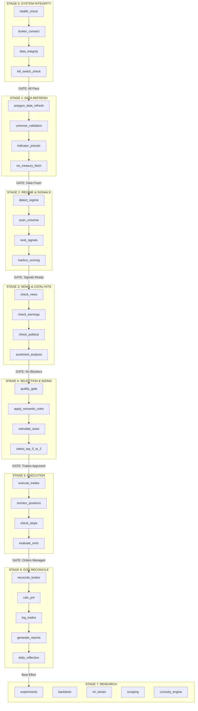

# ORCHESTRATION DAG - Proposed Pipeline Architecture

> Last Updated: 2026-01-07
> Status: Design Document (Future Implementation)

---

## Overview

This document describes a proposed DAG (Directed Acyclic Graph) based orchestration system that would replace the current time-based scheduler with dependency-driven task execution.

---

## Current vs Proposed Architecture

### Current Architecture (Time-Based)
```
Tasks scheduled by time (HH:MM)
    ↓
Sequential execution (one at a time)
    ↓
60-second cycles
    ↓
No dependencies between tasks
```

### Proposed Architecture (DAG-Based)
```
Stage 0: System Integrity
    ↓ (GATE: All must pass)
Stage 1: Data Refresh
    ↓ (GATE: Data freshness verified)
Stage 2: Regime & Signals
    ↓ (GATE: Signals generated)
Stage 3: News & Catalysts
    ↓ (GATE: No blockers)
Stage 4: Selection & Sizing
    ↓ (GATE: Trades approved)
Stage 5: Execution
    ↓ (GATE: Orders placed/managed)
Stage 6: EOD Reconcile
    ↓ (GATE: Day complete)
Stage 7: Research (OFF-PEAK)
    (NO GATE: Best-effort)
```

---

## 8-Stage Pipeline



---

## Stage Details

### Stage 0: System Integrity
**Purpose:** Verify all system components are operational before processing.

| Task | Handler | Timeout | On Failure |
|------|---------|---------|------------|
| health_check | `_handler_health_check` | 10s | ABORT |
| broker_connect | `_handler_broker_connect` | 15s | ABORT |
| data_integrity | `_handler_data_integrity` | 30s | WARN |
| kill_switch_check | `_handler_kill_switch` | 5s | ABORT |

**Gate Condition:** All tasks must pass (except data_integrity which can warn).

---

### Stage 1: Data Refresh
**Purpose:** Ensure all data sources are up-to-date.

| Task | Handler | Timeout | On Failure |
|------|---------|---------|------------|
| polygon_data_refresh | `_handler_polygon_refresh` | 60s | RETRY(3) |
| universe_validation | `_handler_validate_universe` | 30s | WARN |
| indicator_precalc | `_handler_precalc_indicators` | 60s | RETRY(2) |
| vix_treasury_fetch | `_handler_fetch_vix_treasury` | 30s | WARN |

**Gate Condition:** Data freshness verified (< 24 hours old for EOD data).

---

### Stage 2: Regime & Signals
**Purpose:** Detect market regime and generate trading signals.

| Task | Handler | Timeout | On Failure |
|------|---------|---------|------------|
| detect_regime | `_handler_detect_regime` | 30s | DEFAULT(NEUTRAL) |
| scan_universe | `_handler_scan_signals` | 120s | RETRY(2) |
| rank_signals | `_handler_rank_signals` | 30s | FAIL |
| markov_scoring | `_handler_markov_score` | 60s | SKIP |

**Gate Condition:** At least one signal generated with conf_score > 0.60.

---

### Stage 3: News & Catalysts
**Purpose:** Check for news events that could impact trades.

| Task | Handler | Timeout | On Failure |
|------|---------|---------|------------|
| check_news | `_handler_check_news` | 30s | WARN |
| check_earnings | `_handler_check_earnings` | 15s | WARN |
| check_political | `_handler_check_political` | 15s | SKIP |
| sentiment_analysis | `_handler_sentiment` | 30s | SKIP |

**Gate Condition:** No CRITICAL news blockers detected.

---

### Stage 4: Selection & Sizing
**Purpose:** Apply final filters and calculate position sizes.

| Task | Handler | Timeout | On Failure |
|------|---------|---------|------------|
| quality_gate | `_handler_quality_gate` | 15s | FAIL |
| apply_semantic_rules | `_handler_semantic_rules` | 15s | SKIP |
| calculate_sizes | `_handler_calc_sizes` | 15s | FAIL |
| select_top_5_to_2 | `_handler_select_top2` | 10s | FAIL |

**Gate Condition:** At least 1 trade approved with valid size.

---

### Stage 5: Execution
**Purpose:** Execute trades and manage positions.

| Task | Handler | Timeout | On Failure |
|------|---------|---------|------------|
| execute_trades | `_handler_execute_trades` | 60s | RETRY(1) |
| monitor_positions | `_handler_monitor_positions` | 30s | WARN |
| check_stops | `_handler_check_stops` | 15s | WARN |
| evaluate_exits | `_handler_evaluate_exits` | 30s | WARN |

**Gate Condition:** Orders placed (or none needed).

---

### Stage 6: EOD Reconcile
**Purpose:** End-of-day reconciliation and reporting.

| Task | Handler | Timeout | On Failure |
|------|---------|---------|------------|
| reconcile_broker | `_handler_reconcile` | 60s | RETRY(2) |
| calc_pnl | `_handler_calc_pnl` | 30s | WARN |
| log_trades | `_handler_log_trades` | 15s | WARN |
| generate_reports | `_handler_gen_reports` | 60s | SKIP |
| daily_reflection | `_handler_reflection` | 30s | SKIP |

**Gate Condition:** Reconciliation verified (positions match broker).

---

### Stage 7: Research (Off-Peak)
**Purpose:** Self-improvement activities during non-trading hours.

| Task | Handler | Timeout | On Failure |
|------|---------|---------|------------|
| experiments | `_handler_experiments` | 300s | SKIP |
| backtests | `_handler_backtests` | 300s | SKIP |
| ml_retrain | `_handler_ml_retrain` | 300s | SKIP |
| scraping | `_handler_scraping` | 120s | SKIP |
| curiosity_engine | `_handler_curiosity` | 120s | SKIP |

**Gate Condition:** None (best-effort, non-blocking).

---

## Trigger Schedule

| Trigger | Time (ET) | Stages | Notes |
|---------|-----------|--------|-------|
| PREMARKET | 06:00 | 0, 1 | Data prep |
| MARKET_OPEN | 09:30 | 0 (recheck) | Verify systems |
| PRIMARY_WINDOW | 10:00 | 2, 3, 4, 5 | Main trading |
| MIDDAY_CHECK | 12:00 | 5 | Position monitoring only |
| POWER_HOUR | 14:30 | 2, 3, 4, 5 | Secondary window |
| EOD | 16:00 | 6 | Reconciliation |
| OVERNIGHT | 20:00 | 7 | Research |
| WEEKEND | Saturday 07:00 | 7 (extended) | Deep research |

---

## Stage Execution Rules

1. **Dependency**: Stage N must complete before Stage N+1
2. **Idempotency**: Each task can be re-run safely
3. **Timeout**: Configurable per task (default 30s)
4. **Retry**: Configurable per task (default 3 attempts)
5. **Skip if done**: Tasks check `already_run_today` flag
6. **Fail-fast**: Stage failure blocks subsequent stages (except Stage 7)

---

## Implementation Notes

### Gate Implementation
```python
class StageGate:
    def __init__(self, name: str, condition: Callable[[], bool]):
        self.name = name
        self.condition = condition

    def check(self) -> tuple[bool, str]:
        try:
            passed = self.condition()
            return passed, "OK" if passed else f"Gate {self.name} failed"
        except Exception as e:
            return False, f"Gate {self.name} error: {e}"
```

### Stage Executor
```python
async def execute_stage(stage: Stage) -> StageResult:
    for task in stage.tasks:
        result = await execute_task_with_timeout(task)
        if result.failed and task.on_failure == "ABORT":
            return StageResult.ABORTED

    gate_passed, reason = stage.gate.check()
    if not gate_passed:
        return StageResult.GATE_FAILED

    return StageResult.COMPLETED
```

---

## Migration Path

1. **Phase 1**: Document current 462 tasks by stage
2. **Phase 2**: Implement Stage and Gate classes
3. **Phase 3**: Migrate time-based tasks to stage membership
4. **Phase 4**: Add dependency tracking
5. **Phase 5**: Enable parallel execution within stages
6. **Phase 6**: Deprecate time-based scheduler

---

## See Also

- `docs/SCHEDULER_CODEMAP.md` - Current scheduler architecture
- `docs/SAFETY_GATES.md` - Safety gate documentation
- `autonomous/scheduler.py` - Current implementation
